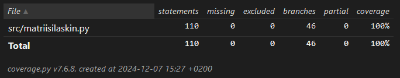

# Testausraportti

## Yksikkötestit

Yksikkötestejä varten käytetään unittest ja Numpy kirjastoja. Yksikkötestit testaavat luokkia Matriisilaskin ja QR_algoritmi. Matriisilaskin -luokan testausta varten luodaan ensin matriiseja (kooltaan esimerkiksi 500 kertaa 50) satunnaisilla luvuilla ja tarkistetaan, että matriisioperaatiot antavat saman vastaukset kuin Numpy kirjasto.

QR_algoritmin -luokassa testataan joitakin apumetodeja sekä QR-hajotelmaa. QR-hajotelman testauksessa tarkistetaan että matriisien Q ja R tulo on yhtä kuin alkuperäinen matriisi. Lisäksi testataan myös, että qr_algoritmi -funktio antaa oikeat ominaisarvot kuin Numpy.

## Pääohjelman testaus

Kansiossa src/data on kymmenen kuvaa neljästäkymmenestä eri henkilön kasvoista. Kun pääohjelma käynnistyy valitaan satunnaisesti esimerkiksi viisi kuvaa viidestä eri henkilöstä, ja nämä kuvat käytetään harjoitusdatana. Loput kuvat käytetään testausdatana, eli testikuvia on tässä tapauksessa 25.

Suorittamalla pääohjelman testin viisi kertaa saadaan seuraavanlainen tulos:
- Tunnistettu 64.0 % kuvista.
- Tunnistettu 88.0 % kuvista.
- Tunnistettu 84.0 % kuvista.
- Tunnistettu 72.0 % kuvista.
- Tunnistettu 76.0 % kuvista.

Jos taas henkilöitä on viisi mutta jokaisesta käytetään kuusi kuvaa harjoitusdatana, on tulos parempi:
- Tunnistettu 95.0 % kuvista.
- Tunnistettu 90.0 % kuvista.
- Tunnistettu 95.0 % kuvista.
- Tunnistettu 80.0 % kuvista.
- Tunnistettu 70.0 % kuvista.
